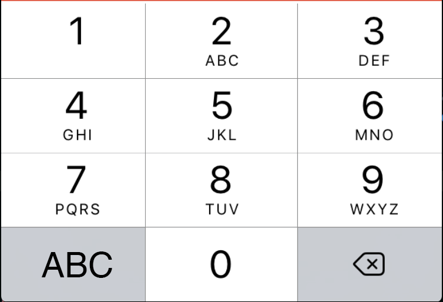

# celularspeak

[](https://github.com/leunardo/celularspeak/actions/workflows/node.js.yml)
[](https://codecov.io/gh/leunardo/celularspeak)


Convert text into numpad of old cellphones.

## Hello world 🔁 44.33.555.555.666.0.9.666.777.555.3




## Website
### https://celspeak.leonardoalves.dev

## NPM Package

[](https://npmjs.org/package/celularspeak)

```js
import { textToPhoneSpeak, phoneSpeakToText } from 'celularspeak'

textToPhoneSpeak('hello world')
// "44.33.555.555.666.0.9.666.777.555.3"

phoneSpeakToText('44.33.555.555.666.0.9.666.777.555.3')
// "hello world"
```

## Running tests

`npm test`
